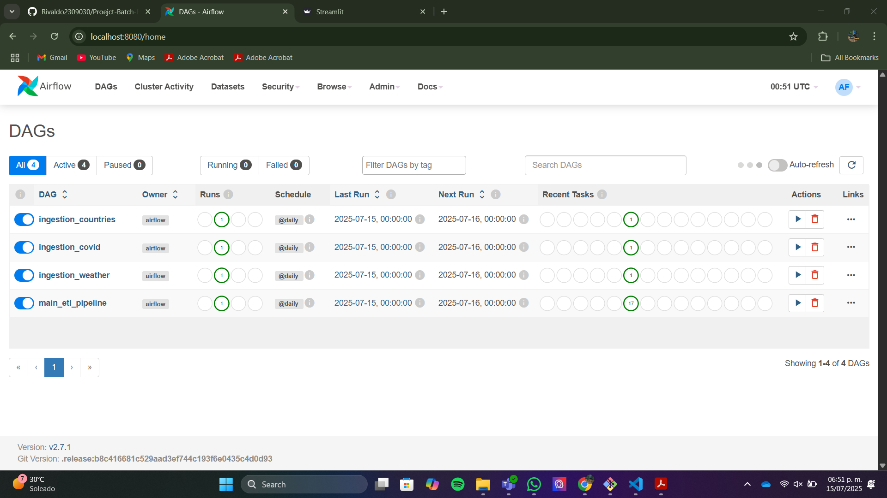
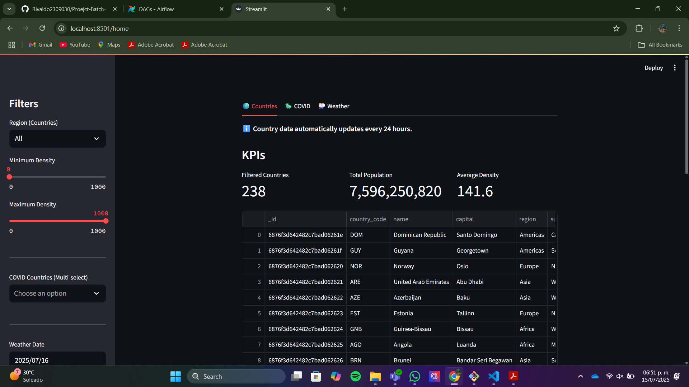

# 📂 ETL Pipeline with Airflow, MongoDB, and Streamlit
Objective

Build a fully functional batch ETL pipeline, orchestrated using **Apache Airflow**, that ingests data from at least **three different public APIs**, processes and stores the data in **MongoDB**, and presents insights through a web-based **Streamlit dashboard**.

The entire solution must be containerized using Docker Compose, and must expose the following services for local development and testing.

Everything runs via Docker Compose for easy deployment.

---

## 🛠️ Technologies Used

- **Apache Airflow** (workflow orchestration)
- **MongoDB** (raw + processed data storage)
- **Streamlit** (interactive dashboard)
- **Docker Compose** (container orchestration)
- Python libraries: `requests`, `pandas`, `pymongo`, `altair`

---

## 🌐 Public APIs Used

✅ **COVID-19 Data**  
[https://disease.sh/](https://disease.sh/)

✅ **Weather Data**  
[https://open-meteo.com/](https://open-meteo.com/)

✅ **Countries Metadata**  
[https://restcountries.com/](https://restcountries.com/)

---

## 🗃️ Why MongoDB and Not PostgreSQL? ❌

- In this project, MongoDB was chosen as the primary database for storing both raw and processed data instead of a traditional relational database like PostgreSQL because:

- Schema flexibility: The data coming from public APIs varies in structure and may evolve over time. MongoDB’s document-based model allows storing JSON-like objects without a fixed schema, making it easier to adapt.

- Nested and hierarchical data: COVID stats, weather reports, and country metadata often contain nested objects or arrays. MongoDB handles these naturally.

- Faster development: Since this is a batch ETL project with JSON data, MongoDB reduces the need for upfront schema design and migrations.

- Good integration with Python: PyMongo makes it easy to interact with MongoDB from Airflow tasks.

- While PostgreSQL is great for relational and transactional data with complex joins, in this scenario, MongoDB’s document model is a better fit for semi-structured API data ingestion and transformation.


## 🧩 Project Architecture

```
Project_massive_data_5B_Rivaldo/
├── dags/
│ ├── main_pipeline.py # Unified DAG for all datasets
│ ├── ingestion_covid.py # Extract COVID data
│ ├── ingestion_weather.py # Extract weather data
│ ├── ingestion_countries.py # Extract countries data
│ ├── transform_covid.py # Transform COVID data
│ ├── transform_weather.py # Transform weather data
│ ├── transform_countries.py # Transform countries data
│ └── load_mongo.py # Load data into MongoDB
│
├── utils/
│ ├── mongo_utils.py # MongoDB connection helper
│ └── transform.py # Reusable transformation helpers
├── stremlit_app/
│ ├── app.py
│ ├── Dockerfile
│ ├── requirements.txt
├── Docker-compose.yml 
├── requirements.txt 
└── README.md 
```

> **Note:** Airflow lists DAGs alphabetically in the UI; this does not affect execution order :).

## 📋 Features

✅ Batch ingestion of **3 APIs**, storing **raw JSON data** in MongoDB  
✅ Data cleaning, standardization, and enrichment (e.g., derived fields like population density)  
✅ XComs for passing metadata and transformed payloads between tasks  
✅ Idempotent DAG: safe to re-run without duplicating data  
✅ Streamlit dashboard with interactive filters and visualizations:
- Countries KPIs and charts
- COVID statistics
- Weather trends

---

## 🧑‍💻 How to Run Locally

### 1️⃣ Clone the Repository

```bash
git clone https://github.com/Rivaldo2309030/Proejct-Batch-ETL-with-Docker-by-Rivaldo.git
cd Proejct-Batch-ETL-with-Docker-by-Rivaldo
 ```
 ## Build n start DOCKER CONTAINERS
```
 docker-compose up --build
```
 This will launch Airflow, MongoDB, and Streamlit services in Docker containers.

## Acces to the Airflow UI
Open in your browser:

http://localhost:8080

From there, you can manually activate and execute the main_pipeline DAG to run the ETL pipeline.

## Access the Streamlit Dashboard
After the pipeline has processed the data, open:

http://localhost:8501

There you can explore interactive visualizations of the loaded data.

## 📦📦📦📦 How XComs Are Used in This Project 📦📦📦📦📦📦
Apache Airflow’s XComs (short for “cross-communication”) allow tasks within a DAG to exchange small pieces of data. In this pipeline:

XComs pass metadata like the timestamp of the last successful run, so subsequent runs know which data to extract incrementally.

Transformed data payloads (like cleaned COVID or weather records) are temporarily shared between extraction, transformation, and loading tasks.

This avoids writing intermediate files or querying the database multiple times.

Using XComs helps keep tasks loosely coupled but coordinated, improving pipeline efficiency and clarity.

For example, the main_pipeline.py DAG uses XComs to pass the last success time to the ingestion tasks, ensuring only new data is fetched.

## Useful Commands
To view a container's logs:

```
docker-compose logs -f <service_name>
```
To stop containers:

```
docker-compose down
```
## To run the DAG manually in Airflow UI:

Find main_pipeline in the DAG list

Turn it ON

Click the "Trigger DAG" button

## 📝 Notes
The collections in MongoDB for raw and processed data are named raw_<dataset> and processed_<dataset>.

The pipeline is designed to be idempotent and avoid duplicates.

The orchestration uses XComs to pass information between tasks.

The docker-compose.yml file configures all the services needed to run the project locally.

## 📸 Screenshots

### Airflow UI



## Streamlit dashboard 



## CONTACT

- **Name:** Rivaldo Canche
- **Email:** angelrivaldoc@gmail.com
- **GitHub:** [https://github.com/Rivaldo2309030](https://github.com/Rivaldo2309030)
- **LinkedIn:** [www.linkedin.com/in/rivaldo-canche-10a497321](https://linkedin.com/in/rivaldo-canche-10a497321)  :)